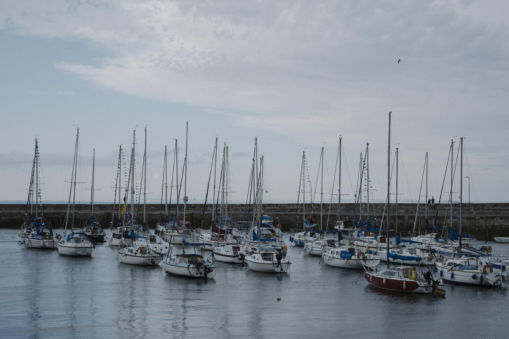
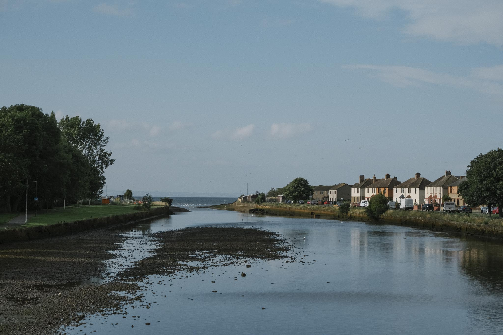
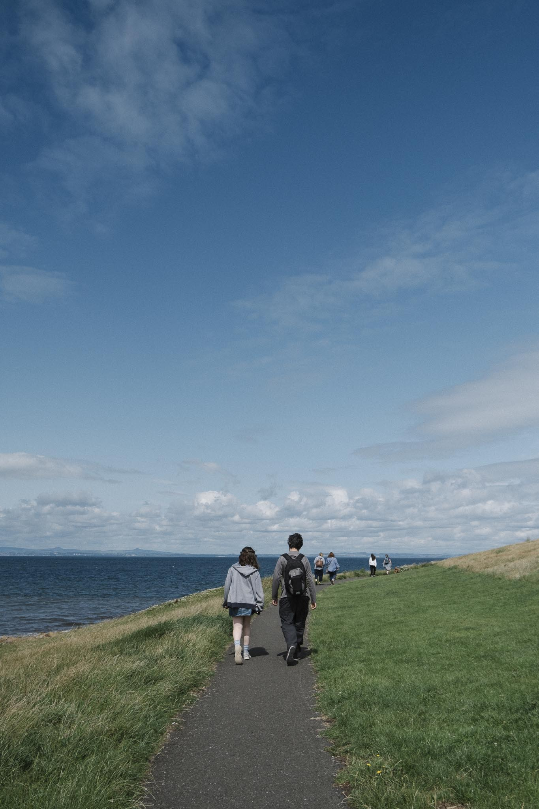
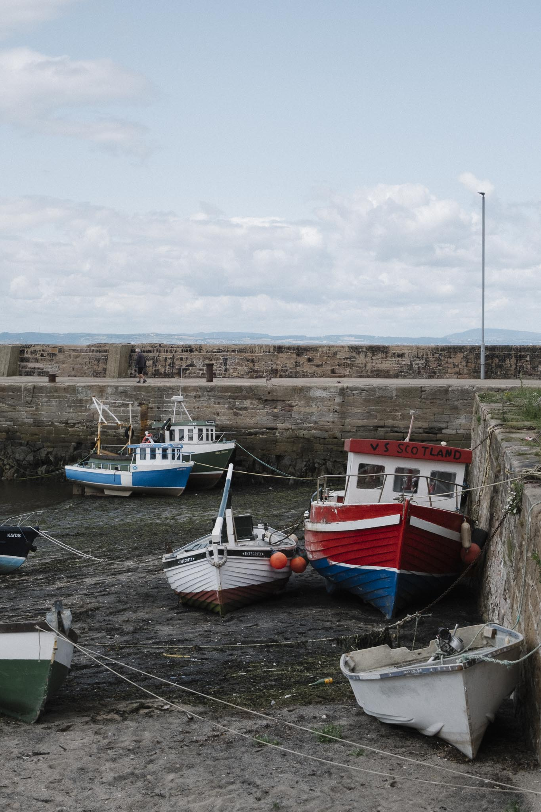
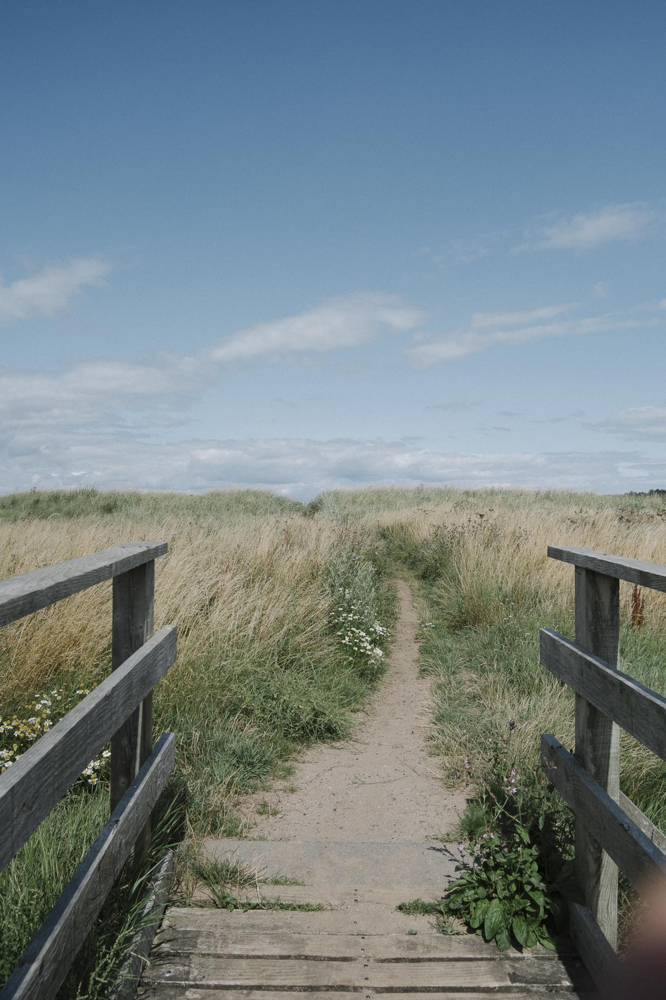
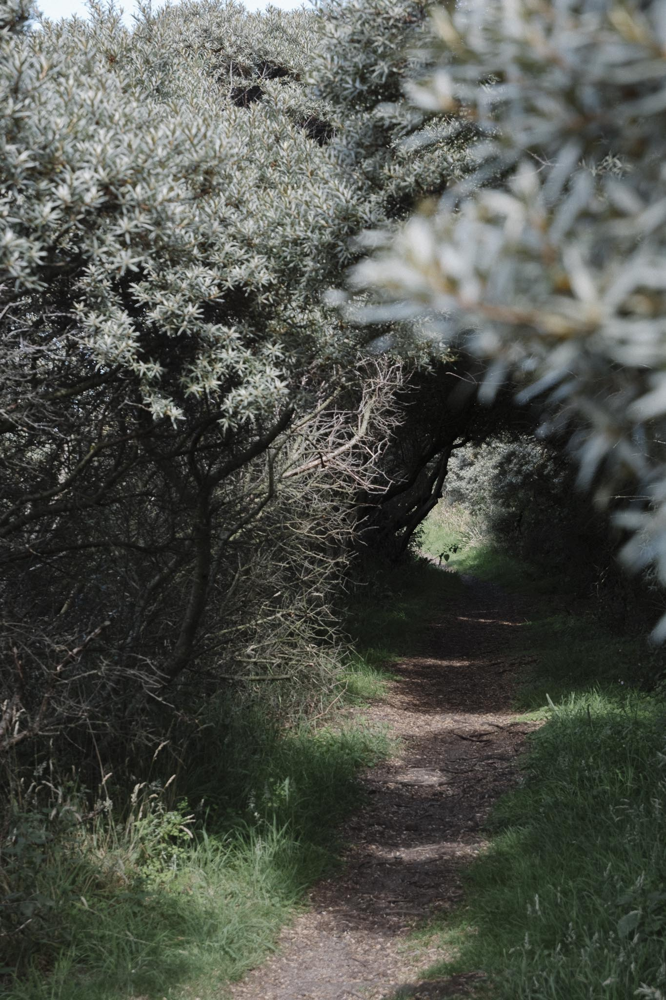
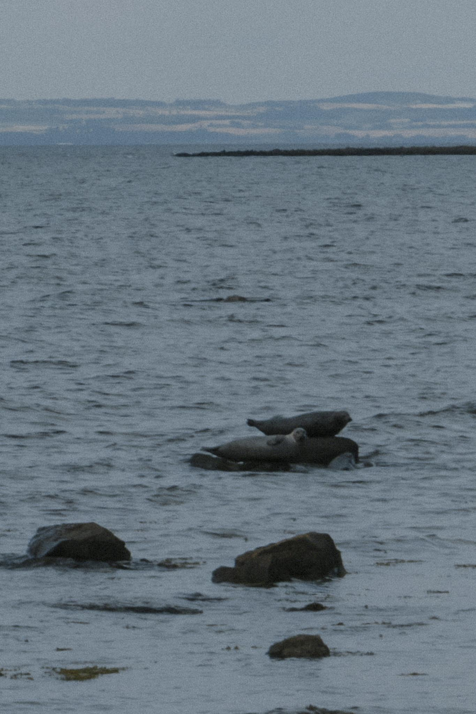
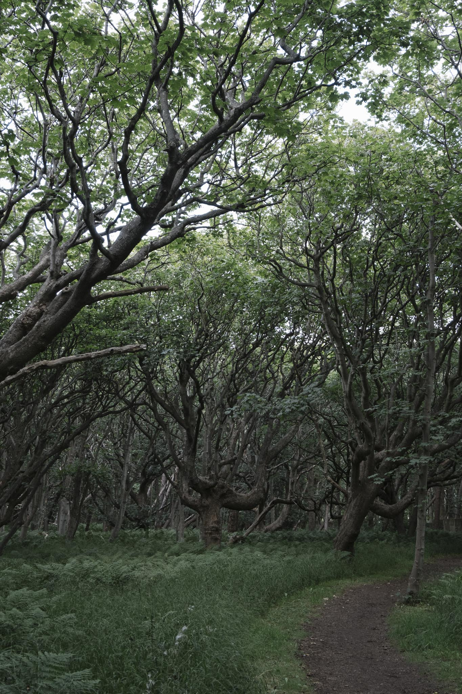

# Leith To Aberlady

## Walk Metadata

| Attribute | Value |
| --------- | ----- |
| **Difficulty** | Moderate |
| **Distance** | 28.6 km |
| **Duration** | 6.5 - 7.5 hours |
| **Elevation Gain** | 80 m |
| **Terrain** | Coastal path, sandy beaches, rocky sections, urban walkways |
| **Accessibility** | Some uneven terrain; generally suitable for determined walkers |
| **Can be done by public transport** | Yes |

## Getting There

**Start:** Leith, Edinburgh
- **Train**: Edinburgh Waverley
- **Bus**: Multiple services to Leith from Edinburgh city centre
- **Parking**: Permit parking, so best avoided

**End:** Aberlady, East Lothian
- **Train**: None (nearest is Drem or North Berwick station)
- **Bus**: X5 or 124 from Aberlady back to Edinburgh

## Route

| Section Walked | Distance | Date |
| -------------- | -------- | ---- |
| Leith to Joppa | 6.6 km | Various dates |
| Joppa to Prestonpans | 9 km | Various dates |
| Prestonpans to Aberlady | 13 km | 26/7/2025 |

## Highlights

- Leith waterfront with historic docks and modern development
- Portobello beach and promenade
- Musselburgh's iconic bridge and river estuary
- Prestonpans colliery heritage and coastal views
- Aberlady Bay and nature reserve (excellent for birdwatching)
- Varied coastal landscape with sandy and rocky sections

## Notes

- **Tide Considerations**: Some sections are best walked at lower tides; check tide times for your planned walking dates
- **Facilities**: Cafés and shops in Leith, Portobello, Musselburgh, Prestonpans, and Aberlady. Some of our favourites are:
  - `Tanifiki`, `Rising Tide`, `Miro's`, `Beach House`, `Civerinos`, `Pronto`, and `Shrimpwreck` in Portobello. If you are walking on the weekend, get sandwiches from `Aemilia`.
  -  The `Old Bakehouse Tearoom` for cakes and scones (summer only). `Old Aberlady Inn` does good food.
- **Public Toilets**: Available at Ocean Terminal, Portobello Bath Street, Musselburgh High Street, and Prestonpans Lidl.
- **Best Time**: Spring and autumn for pleasant weather; summer for longer daylight hours
- **Weather**: Coastal winds can be strong; prepare accordingly

### Notes from Experience

- Some sections walked as part of the John Muir Way
- Read the walk report and see photos from the Prestonpans to Aberlady section on our [two-together blog](https://two-together.com/prestonpans-to-aberlady-walk/)

## Gallery

Fisherrow harbour

Musselburgh coastline

Prestonpans coast walk

Port Seton harbour

Heading towards Longniddry Bents

Seabuckthorn hedges in Longniddry

Seal spotting near Gosford House

Approaching the woods near Aberlady

